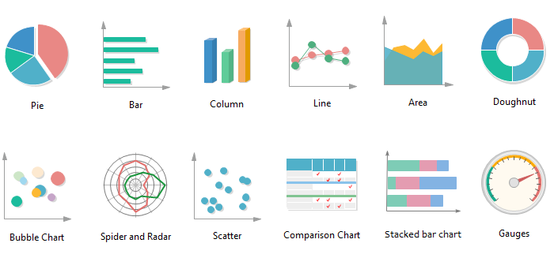
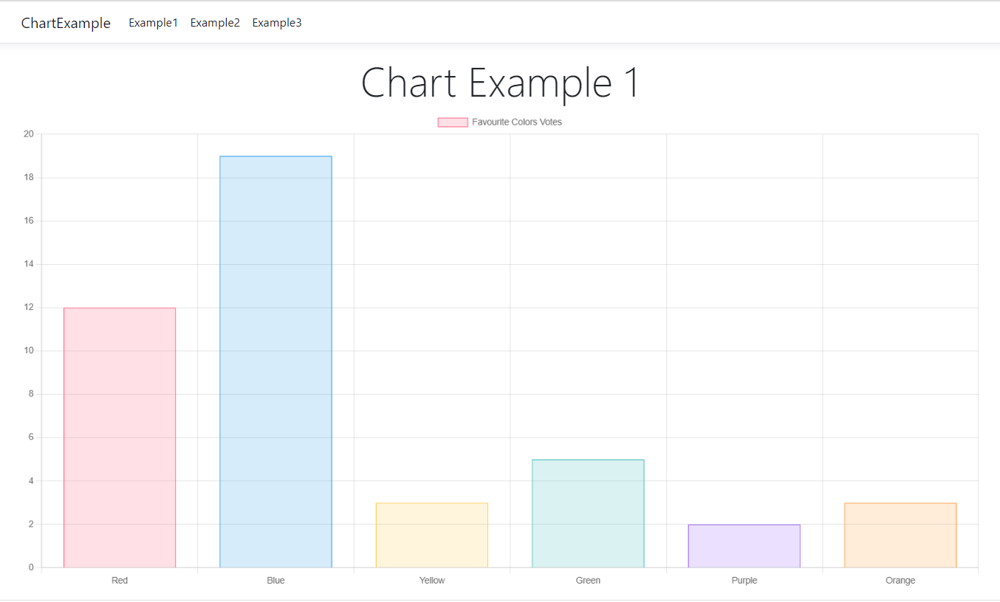

<head>
<style>
    body{
        font-family: Georgia, sans-serif;
        font-size: 12pt;
    }
    h3{
        font-weight: bold;
    }
    img{
        width: 90%;
        height: auto;
    }
    img + figcaption{
        text-align: center;
    }
    img + figcaption a{
        color: grey;
    }
    .pagebreak { page-break-after: always; }
</style>
</head>

<div style="text-align:center;">

</div>

<br>

# Lab 12 - Graphs and Charts in Razor Pages

## Types of Charts
</img>
<figcaption><a href="https://www.analyticsvidhya.com/blog/2021/08/8-essential-charts-you-must-know-to-excel-in-the-art-of-data-visualization/">source</a></figcaption>

## Drawing charts with Chart.js

### Setup
1. Once you have your project created on Visual Studio, right-click on your project (not solution), and select _Manage client-side libraries_
1. A `libman.json` file will open up. Add the chartjs library to it.

```js
{
  "version": "1.0",
  "defaultProvider": "cdnjs",
  "libraries": [
    { //add this block of code
      "library": "Chart.js@4.3.0",
      "destination": "wwwroot/lib/chartjs"
    }
  ]
}
```
3. Hit Ctrl-S to save and Visual Studio will download the package to your destination folder (wwwroot/lib/chartjs in this case).
4. Install the latest version of **Newtonsoft.Json** from NuGet.
5. Go to this [Google drive link](https://drive.google.com/drive/folders/1ON3KzAw0Pbh0TAFO4VcExjQvIvTJuOpM?usp=sharing) and download all the files inside the Chart folder. Add them to your project inside a Models folder.
6. Once you have your models in a folder in your project, the next step is to add the JavaScript to the `_Layout.cshtml` as the last line in HTML:
```html
<script type="module" src="~/lib/chartjs/chart.umd.js"></script>
```

### Using Chart.js inside index.cshtml
1. Create a canvas
```html
<div class="chart-container" width="600" height="400">
    <canvas id="barChart"></canvas>
</div>
```
2. Add the script to create the chart. 
```html
<script type="module">
    document.addEventListener('DOMContentLoaded', (event) => {

        var ctx = document.getElementById('barChart');
        var myChart = new Chart(ctx, @Html.Raw(Model.ChartJson) );
    });
</script>
```
3. To finish this project, we need to write the "code-behind" for the OnGet method.

```js
public class IndexModel : PageModel
{
    public ChartJs Chart { get; set; }
    public string ChartJson { get; set; }

    public void OnGet()
    {
        // Ref: https://www.chartjs.org/docs/latest/
        var chartData = @"
        {
            type: 'bar',
            responsive: true,
            data:
            {
                labels: ['Red', 'Blue', 'Yellow', 'Green', 'Purple', 'Orange'],
                datasets: [{
                    label: 'Favourite Colors Votes',
                    data: [12, 19, 3, 5, 2, 3],
                    backgroundColor: [
                    'rgba(255, 99, 132, 0.2)',
                    'rgba(54, 162, 235, 0.2)',
                    'rgba(255, 206, 86, 0.2)',
                    'rgba(75, 192, 192, 0.2)',
                    'rgba(153, 102, 255, 0.2)',
                    'rgba(255, 159, 64, 0.2)'
                        ],
                    borderColor: [
                    'rgba(255, 99, 132, 1)',
                    'rgba(54, 162, 235, 1)',
                    'rgba(255, 206, 86, 1)',
                    'rgba(75, 192, 192, 1)',
                    'rgba(153, 102, 255, 1)',
                    'rgba(255, 159, 64, 1)'
                        ],
                    borderWidth: 1
                }]
            },  
            options:
            {
                scales:
                {
                    y: [{
                        ticks:
                        {
                            beginAtZero: true
                        }
                    }]
                }
            } 
        }"; //end of chartdata

        Chart = JsonConvert.DeserializeObject<ChartJs>(chartData);
        ChartJson = JsonConvert.SerializeObject(Chart, new JsonSerializerSettings
        {
            NullValueHandling = NullValueHandling.Ignore,
        });
    }   //end of OnGet()
}   //end of class
```

Output:



## Resources and Other Ways of Drawing Charts
- You may look into the Chart Helper, but it only works for .NET Framework projects. It does not work for .NET Core.
- You may also look into Google Charts. It has a fairly similar setup to ChartJs. Here's an article about [Integrating Google Charts in ASP.NET Core](https://dotnetthoughts.net/integrating-google-charts-in-aspnet-core/)
- [Using Google Charts in ASP.NET Core Web App](https://www.youtube.com/watch?v=mksUls9fx-Q)
- Main Reference: [Building charts with razor pages](https://www.danylkoweb.com/Blog/aspnet-core-building-charts-with-razor-pages-QR)
